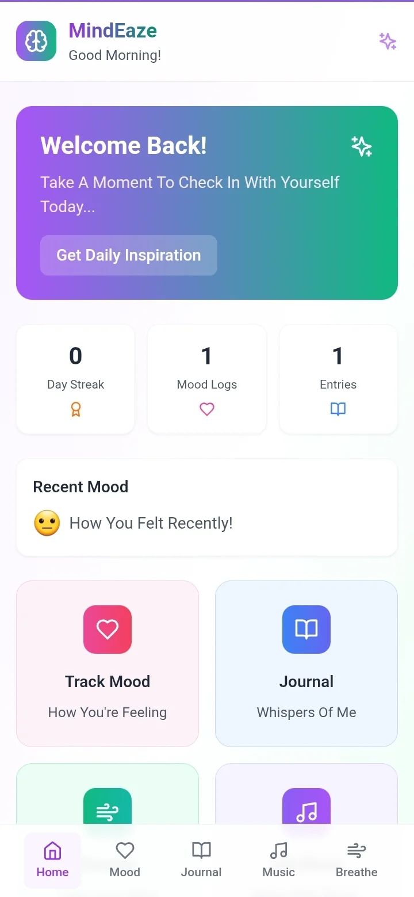
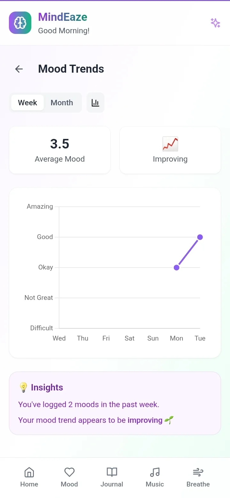
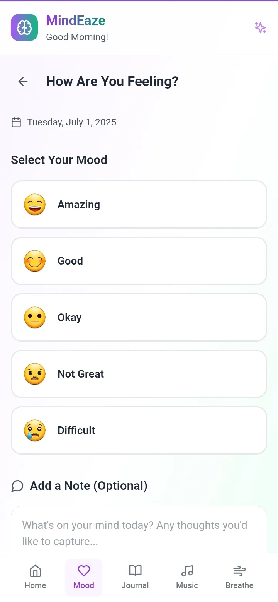
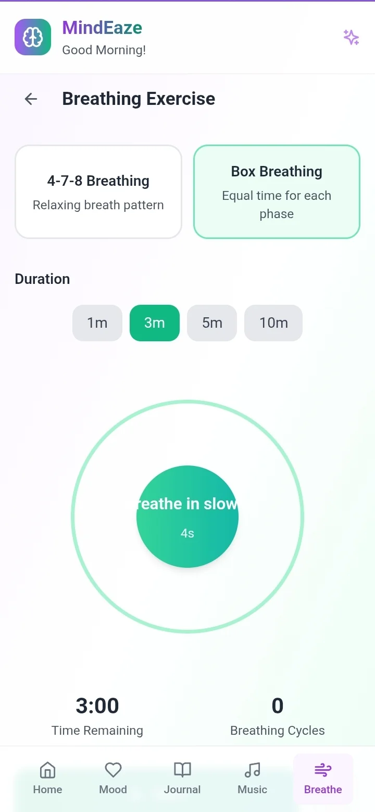
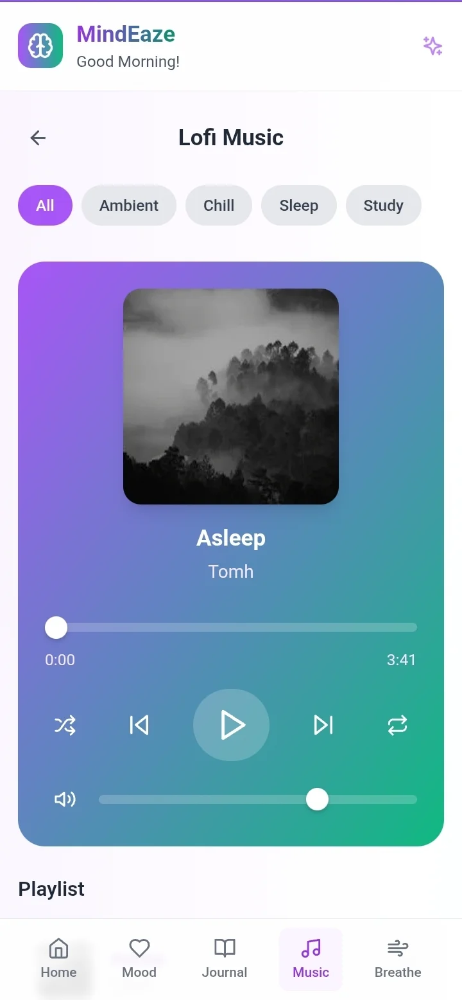

# 🌿 MindEaze – Your Daily Mood Journal & Wellness Buddy

**MindEaze** is a minimalist, offline-first **Progressive Web App** crafted to support users on their mental wellness journey. With features like mood tracking, guided journaling, calming breathing exercises, soothing music, and uplifting prompts. MindEaze is designed to help you reflect, relax, and recharge, one day at a time.

Built using **React**, **TypeScript**, **TailwindCSS**, and **Vite**, it offers a smooth, responsive, and distraction-free experience without requiring logins or internet access.

<br>

## 📚 Table of Contents

* [✨ Features](#-features)
* [📸 Preview](#-preview)
* [📁 Project Structure](#-project-structure)
* [⚙️ Technologies Used](#-technologies-used)
* [🚀 Getting Started](#-getting-started)
* [🧪 Usage Guide](#-usage-guide)
* [🎥 Demo](#-demo)
* [🌈 Customization Ideas](#-customization-ideas)
* [🛠️ Future Improvements](#-future-improvements)
* [🤝 Contributing](#-contributing)
* [📄 License](#-license)
* [📄 Credits](#-credits)
* [📢 Author](#-author)

<br>

## ✨ Features

✅ Emoji-based **Mood Tracker** <br>
✅ Guided **Journaling Prompts** <br>
✅ Animated **Breathing Exercises** <br>
✅ Built-in **Music Player** <br>
✅ Daily **Uplifting Quotes** <br>
✅ **Mood Charts** powered by Chart.js <br>
✅ **Offline-ready** (PWA support) <br>
✅ Clean, responsive, and distraction-free UI

<br>

## 📸 Preview

| **Home Page**                                       | **Mood Trends Page**                                |
| --------------------------------------------------- | --------------------------------------------------- |
|     |  |

| **Mood Tracker Page**                               | **Journal Page**                                    |
| --------------------------------------------------- | --------------------------------------------------- |
|  |      |

| **Breathing Exercise Page**                         | **Lofi Music Page**                                 |
| --------------------------------------------------- | --------------------------------------------------- |
|       |    |
    
<br>

## 📁 Project Structure

```bash
MindEaze/
├── public/
│   ├── assets/                 # App Icons & UI Media
│   ├── manifest.json           # PWA Settings
│   └── sw.js                   # Service Worker
│
├── src/
│   ├── components/             # MoodChart, Journal, MusicPlayer, etc.
│   ├── services/               # Local Storage & Helper Logic
│   ├── App.tsx                 # App Layout & Routing
│   ├── main.tsx                # Entry Point
│   └── index.css               # Global Styles
│
├── dev-dist/                  # Vite-Generated PWA Files
├── index.html
├── tailwind.config.js         # Tailwind Config
├── vite.config.ts             # Vite Setup
└── package.json
```

<br>

## ⚙️ Technologies Used

| Tech                   | Purpose                                 |
| ---------------------- | --------------------------------------- |
| **React (TypeScript)** | Component architecture with type safety |
| **TailwindCSS**        | Utility-first responsive styling        |
| **Vite**               | Fast dev + PWA bundling                 |
| **Chart.js**           | Mood tracking data visualization        |
| **Web Audio API**      | Music playback engine                   |
| **Service Workers**    | Offline support and caching             |
| **Netlify**            | Free hosting with SPA support           |

<br>

## 🚀 Getting Started

To run the project locally:

1. **Clone the repository**

```bash
git clone https://github.com/FrostByte-49/MindEaze.git
cd MindEaze
```
---

2. **Install dependencies**

```bash
npm install
```
---

3. **Start the development server**

```bash
npm run dev
```
---

4. Open `http://localhost:5173` in your browser.

<br>

## 🧪 Usage Guide

1. Open the site in a browser (mobile/desktop).
2. Use the browser menu → **"Add to Home Screen"** to install.
3. Tap the app icon to launch MindEaze.
4. Navigate through:

   * Mood Tracker → log your emotions
   * Mood Chart → view emotion trends
   * Journal → write reflections
   * Breathing → relax and focus
   * Music → play ambient sounds
   * Uplift → get a motivational boost

<br>

## 🎥 Demo

Watch the full walkthrough video showcasing MindEaze in action:

[](https://youtube.com/shorts/ry1rM0-wx90?feature=share)

<br>

## 🌈 Customization Ideas

* 🔔 Add push notification reminders
* 🌕 Enable dark/light mode toggle
* 📊 Add mood-based analytics or reports
* 🗃️ Export mood/journal data as PDF
* 🎤 Voice notes for journal entries

<br>

## 🛠️ Future Improvements

* [ ] Cloud sync with Firebase
* [ ] AI-generated journal prompts
* [ ] Mood-based music recommendations
* [ ] Support for multiple users
* [ ] Real-time backup + settings

<br>

## 🤝 Contributing

Whether you're fixing bugs, building new features, improving performance, or even enhancing UI – We’d **love to have you onboard**! 

### 📦 Set up in Seconds

```bash
# 1. Fork the repository 🍴
git clone https://github.com/FrostByte-49/MindEaze.git
cd MindEaze


# 2. Create your feature branch 🌱
git checkout -b feature/your-feature-name


# 3. Make your changes 🎯


# 4. Commit and push 🚀
git commit -m "✨ Added: Short description of what you did"
git push origin feature/your-feature-name


# 5. Open a Pull Request 🔁
```

### 🧑‍💻 What You Can Work On

Here are some areas where **you can contribute**:

* 🔧 Bug Fixes
* 🎨 UI/UX Improvements
* 📖 Documentation & Accessibility
* 🔌 API Integrations <br><br>

### 💬 Got an Idea?

If you have feedback, feature suggestions, or questions:

* 📬 Open an **issue** on GitHub
* 🧠 Start a **discussion**
* 💌 Drop a suggestion

We truly believe **great things are built together**, and we’d love for you to be part of this journey.  💖 

<br>

## 📄 License

This Project is licensed under the [MIT License](https://opensource.org/licenses/MIT). Feel free to explore and build upon it. <br>
**© 2025 Pranav Khalate**  

```text
Permission Is Hereby Granted, Free Of Charge, To Any Person Obtaining A Copy...
```

<br>

## 🙌 Credits

* [Chart.js](https://www.chartjs.org/) – Graphs and visualization
* [Vite](https://vitejs.dev/) – Lightning-fast PWA tooling
* [TailwindCSS](https://tailwindcss.com/) – Styling
* [Netlify](https://netlify.com/) – Deployment
* [Google Fonts](https://fonts.google.com/) – Typography

<br>

## 📢 Author

**Created by Pranav Khalate**

[](https://github.com/FrostByte-49) &nbsp;
[](mailto:pranav.kh49@gmail.com) &nbsp;
[](https://www.linkedin.com/in/pranav-kh/) &nbsp;
[](https://discord.com/users/1377918872925241375)


<br>

## 📌 Support the Project

If you found **MindEaze** helpful or inspiring, consider giving this repository a ⭐️ – It helps others discover it and keeps the project growing!

<br>

> 💬 *Have feedback or want to collaborate? Drop me a message or open an issue!*

